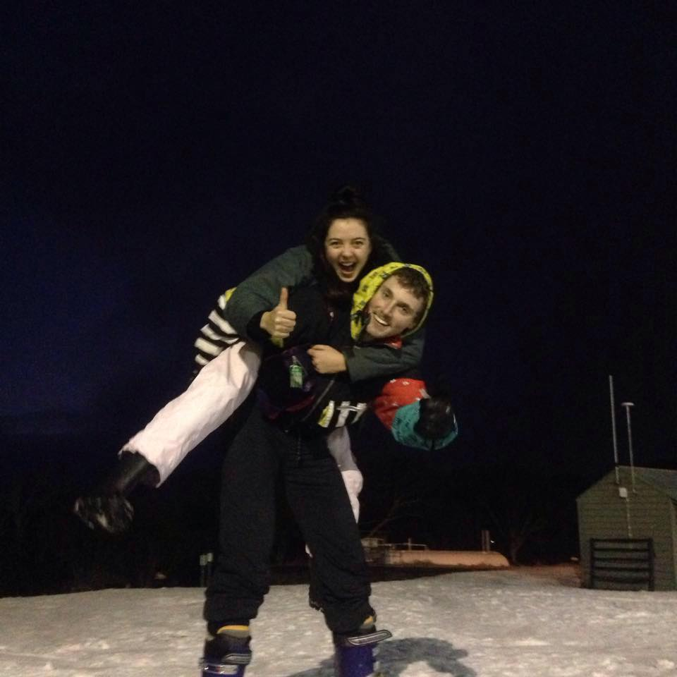
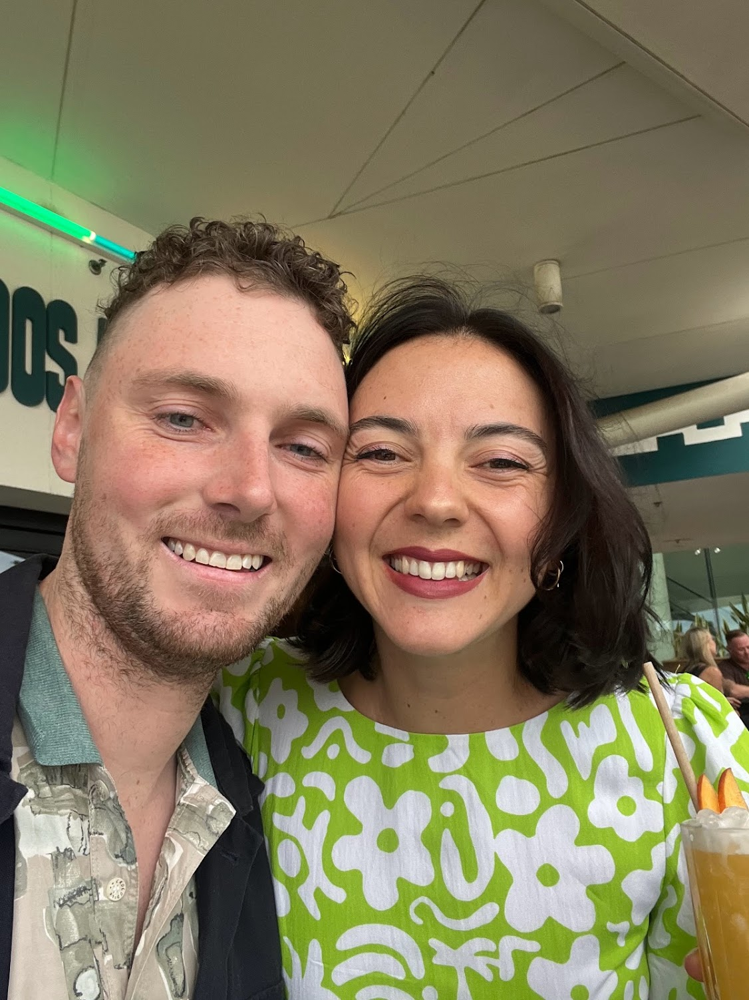
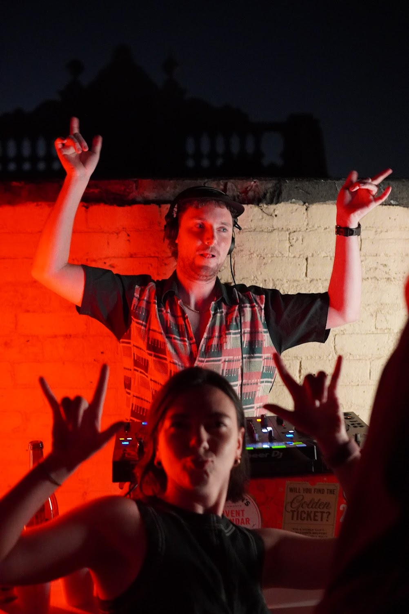
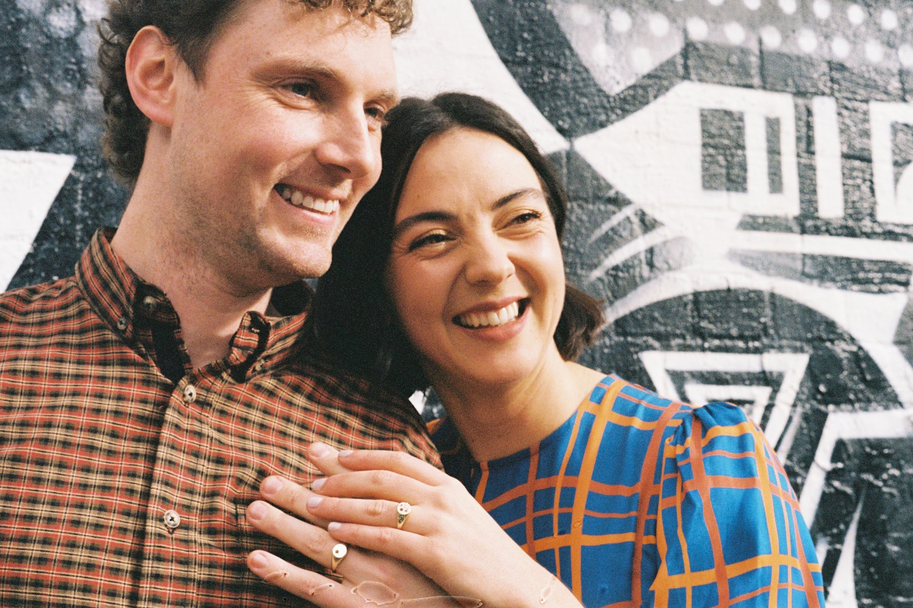
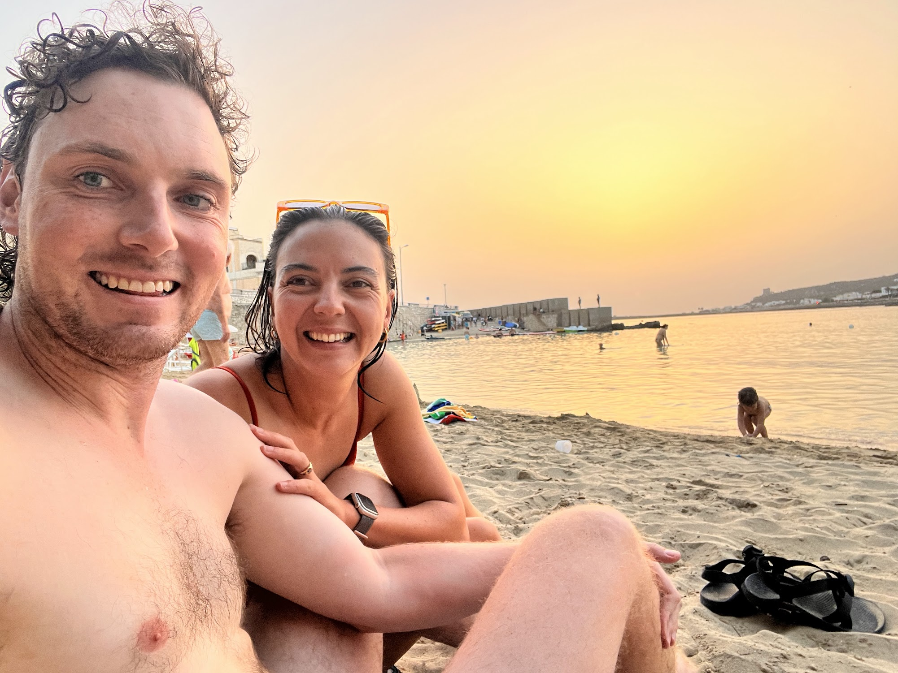
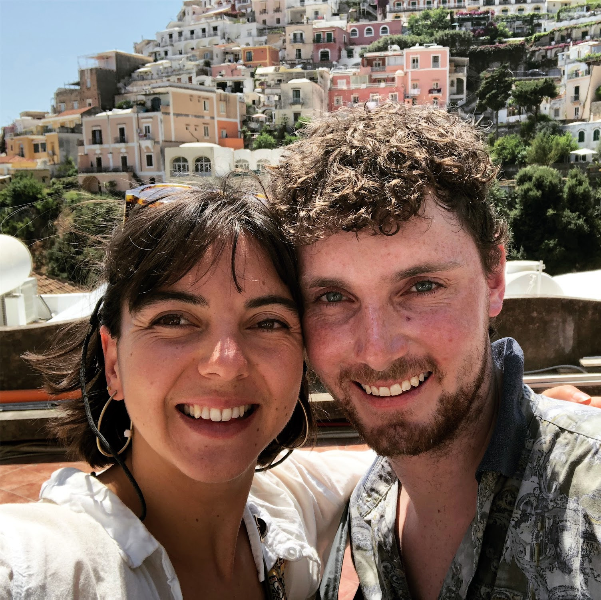
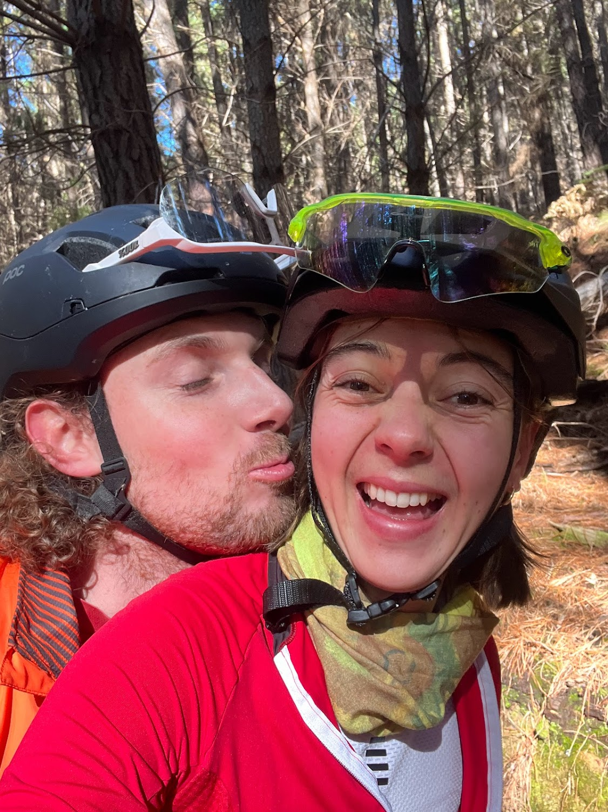
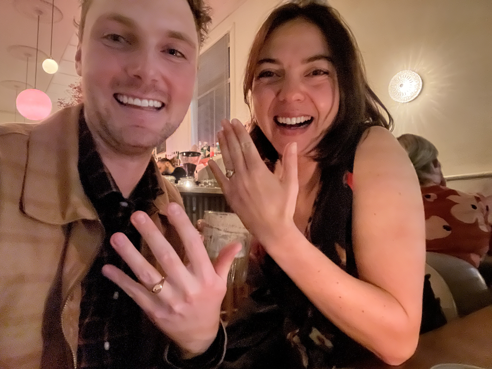


<!-- Error message for missing/invalid personalization -->
<section id="invitation-error" class="error-section" style="display: none;">
  

    <h1 class="error-title">Oops!</h1>
    
This is a personalized wedding invitation.

    
Please use the link that was sent to you.

    
If you believe this is an error, please contact us.

  

</section>

<!-- Main invitation content -->

  <section class="hero-section">
    
    

      <h1 class="hero-title">Dear ,</h1>

      <!-- Let's Go Button -->
      <button class="hero-btn lets-go-btn" id="letsGoBtn" onclick="toggleExperience()">
        <svg class="speaker-icon" width="22" height="22" viewBox="0 0 24 24" fill="currentColor">
          <path d="M3 9v6h4l5 5V4L7 9H3zm13.5 3c0-1.77-1.02-3.29-2.5-4.03v8.05c1.48-.73 2.5-2.25 2.5-4.02zM14 3.23v2.06c2.89.86 5 3.54 5 6.71s-2.11 5.85-5 6.71v2.06c4.01-.91 7-4.49 7-8.77s-2.99-7.86-7-8.77z"/>
        </svg>
        Let's go!
        <svg class="stop-icon" width="20" height="20" viewBox="0 0 24 24" fill="currentColor" style="display: none;">
          <rect x="4" y="4" width="16" height="16"></rect>
        </svg>
      </button>
      

        
        
        
        
        
      

    

    <!-- Hidden Audio Player -->
    <audio id="audioPlayer" preload="auto">
      <source src="audio/praise-you-mix.mp3" type="audio/mpeg">
    </audio>
  </section>

  <section class="wedding-section">
    

      

        <h2 class="section-title">our story</h2>
        
started back in 2014

      

      
    

  </section>

  <section class="wedding-section">
    

      

        <h2 class="section-subtitle">so it's about time</h2>
      

      
    

  </section>

  <section class="wedding-section">
    

      

        <h2 class="section-title">we celebrate it!</h2>
      

      
    

  </section>

  <section class="wedding-section">
    

      

        <h2 class="hero-title">, you're invited</h2>
      

      
    

  </section>

  <section class="wedding-section">
    

      

        <h2 class="hero-subtitle">to join us</h2>
      

      
    

  </section>

  <section class="wedding-section">
    

      

        <h2 class="section-title">in celebrating</h2>
      

      
    

  </section>

  <section class="wedding-section">
    

      

        <h2 class="section-title">our love</h2>
      

      
    

  </section>

  <section class="wedding-section">
    

      

        <h2 class="section-title">and our adventures</h2>
      

      
    

  </section>

  <section class="wedding-section">
    

      

        <h2 class="section-title">at our wedding!</h2>
      

      
      <!--  -->
    

  </section>

  <section class="wedding-section deets-section">
    

      

        <h2 class="section-title">The deets</h2>
        

          
So far we can tell you...

          
date: Saturday November 28th 2026, from midday-ish

          
location: in and around brunswick

          

            

              <button class="calendar-button" onclick="toggleCalendarMenu(event)">
                <svg width="20" height="20" viewBox="0 0 24 24" fill="none" stroke="currentColor" stroke-width="2" style="vertical-align: middle; margin-right: 8px;">
                  <rect x="3" y="4" width="18" height="18" rx="2" ry="2"></rect>
                  <line x1="16" y1="2" x2="16" y2="6"></line>
                  <line x1="8" y1="2" x2="8" y2="6"></line>
                  <line x1="3" y1="10" x2="21" y2="10"></line>
                </svg>
                Add to Calendar
                <svg width="16" height="16" viewBox="0 0 24 24" fill="none" stroke="currentColor" stroke-width="2" style="vertical-align: middle; margin-left: 8px;">
                  <polyline points="6 9 12 15 18 9"></polyline>
                </svg>
              </button>
              

                <a href="https://calendar.google.com/calendar/render?action=TEMPLATE&text=Milla+%26+Tom%27s+Wedding&dates=20261128/20261129&details=Saturday+November+28th+2026&location=Brunswick%2C+Melbourne" target="_blank" class="calendar-option">
                  <svg width="18" height="18" viewBox="0 0 24 24" fill="currentColor" style="vertical-align: middle; margin-right: 10px;">
                    <path d="M19 4h-1V2h-2v2H8V2H6v2H5c-1.1 0-2 .9-2 2v14c0 1.1.9 2 2 2h14c1.1 0 2-.9 2-2V6c0-1.1-.9-2-2-2zm0 16H5V10h14v10zm0-12H5V6h14v2z"/>
                  </svg>
                  Google Calendar
                </a>
                <a href="https://outlook.live.com/calendar/0/deeplink/compose?subject=Milla+%26+Tom%27s+Wedding&startdt=2026-11-28T00:00:00&enddt=2026-11-29T00:00:00&body=Saturday+November+28th+2026&location=Brunswick%2C+Melbourne" target="_blank" class="calendar-option">
                  <svg width="18" height="18" viewBox="0 0 24 24" fill="currentColor" style="vertical-align: middle; margin-right: 10px;">
                    <path d="M7 2v20l8-4V6L7 2zm10 4v12l4 2V8l-4-2z"/>
                  </svg>
                  Outlook
                </a>
                <a href="invite.ics" class="calendar-option">
                  <svg width="18" height="18" viewBox="0 0 24 24" fill="none" stroke="currentColor" stroke-width="2" style="vertical-align: middle; margin-right: 10px;">
                    <path d="M14 2H6a2 2 0 0 0-2 2v16a2 2 0 0 0 2 2h12a2 2 0 0 0 2-2V8z"></path>
                    <polyline points="14 2 14 8 20 8"></polyline>
                    <line x1="12" y1="18" x2="12" y2="12"></line>
                    <line x1="9" y1="15" x2="15" y2="15"></line>
                  </svg>
                  Apple Calendar / iCal
                </a>
                <a href="invite.ics" download class="calendar-option">
                  <svg width="18" height="18" viewBox="0 0 24 24" fill="none" stroke="currentColor" stroke-width="2" style="vertical-align: middle; margin-right: 10px;">
                    <path d="M21 15v4a2 2 0 0 1-2 2H5a2 2 0 0 1-2-2v-4"></path>
                    <polyline points="7 10 12 15 17 10"></polyline>
                    <line x1="12" y1="15" x2="12" y2="3"></line>
                  </svg>
                  Download .ics file
                </a>
              

            

            <!-- RSVP button - commented out for now
            

              <button class="calendar-button rsvp-button" onclick="toggleRsvpMenu(event)">
                <svg width="20" height="20" viewBox="0 0 24 24" fill="none" stroke="currentColor" stroke-width="2" style="vertical-align: middle; margin-right: 8px;">
                  <path d="M4 4h16c1.1 0 2 .9 2 2v12c0 1.1-.9 2-2 2H4c-1.1 0-2-.9-2-2V6c0-1.1.9-2 2-2z"></path>
                  <polyline points="22,6 12,13 2,6"></polyline>
                </svg>
                RSVP
                <svg width="16" height="16" viewBox="0 0 24 24" fill="none" stroke="currentColor" stroke-width="2" style="vertical-align: middle; margin-left: 8px;">
                  <polyline points="6 9 12 15 18 9"></polyline>
                </svg>
              </button>
              

                <a href="#" onclick="openRsvpEmail('gmail'); return false;" class="calendar-option">Gmail</a>
                <a href="#" onclick="openRsvpEmail('outlook'); return false;" class="calendar-option">Outlook</a>
                <a href="#" onclick="openRsvpEmail('yahoo'); return false;" class="calendar-option">Yahoo Mail</a>
                <a href="#" onclick="openRsvpEmail('default'); return false;" class="calendar-option">Default Mail App</a>
              

            

            -->

          

          

            <form name="wedding-email" method="POST" data-netlify="true" class="wedding-email-form" id="wedding-email-form">
              
Please confirm your email

              
So we can keep you updated with all the details

              

              <!-- Hidden fields for Netlify to detect at build time (JS populates them) -->
              <input type="hidden" name="guest-1" value=""/>
              <input type="hidden" name="guest-2" value=""/>
              <input type="hidden" name="guest-3" value=""/>
              <input type="hidden" name="guest-4" value=""/>
              <input type="hidden" name="guest-5" value=""/>
              <input type="hidden" name="email-1" value=""/>
              <input type="hidden" name="email-2" value=""/>
              <input type="hidden" name="email-3" value=""/>
              <input type="hidden" name="email-4" value=""/>
              <input type="hidden" name="email-5" value=""/>
              <button type="submit">Submit</button>
            </form>
            

              
Thanks!

              
We'll be in touch soon.

            

            

              
Oops!

              
Something went wrong. Please try again.

              <button type="button" id="try-again-btn">Try again</button>
            

          

          

            
If you already know that you won't be able to join us, please let us know as soon as possible as it will help with our planning.

          

          

            
We kindly ask this be an adult-only affair.

          

          

            
Thank you for being a part of our lives up to this point!

          

        

      

    

  </section>

  <section class="wedding-section thank-you-section">
    

      

        <h2 class="section-subtitle">With love,</h2>
        <h2 class="section-subtitle">Milla & Tom</h2>
      

      
    

  </section>

<section class="coming-soon">
    
We'll be in touch with more details soon

  </section>

  


